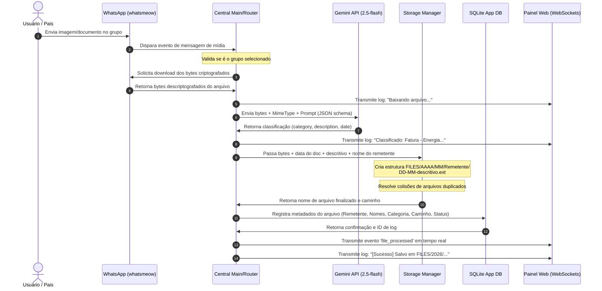

# Arquitetura do Sistema - Zenith File Saver

Este documento descreve a arquitetura interna e o fluxo de dados do **Zenith File Saver**.

---

## Diagrama de Fluxo de Dados

Abaixo está o fluxo detalhado de como um arquivo enviado no grupo do WhatsApp é processado até ser salvo localmente.

---

## Descrição dos Componentes

O projeto segue os princípios de clean code, desacoplamento e programação estruturada. Está dividido nos seguintes pacotes Go:

### 1. Pacote `config` (`internal/config`)
- **Responsabilidade**: Gerenciar os parâmetros de configuração do aplicativo.
- **Armazenamento**: Salvo em `data/config.json`.
- **Campos**:
  - `gemini_api_key`: A chave para a API do Gemini.
  - `monitored_group_jid`: O ID único do WhatsApp do grupo selecionado.
  - `monitored_group_name`: O nome legível do grupo monitorado.
  - `port`: A porta do servidor Web (padrão: `8080`).

### 2. Pacote `db` (`internal/db`)
- **Responsabilidade**: Gerenciar o banco de dados interno de auditoria de arquivos (`data/app.db`).
- **Esquema da Tabela (`file_logs`)**:
  - `id` (INTEGER PRIMARY KEY AUTOINCREMENT)
  - `sender_name` (TEXT) - Nome de exibição ou número do remetente.
  - `sender_jid` (TEXT) - JID exclusivo do remetente.
  - `original_name` (TEXT) - Nome original do documento.
  - `new_name` (TEXT) - Novo nome formatado e gerado (`DD-MM-descricao.ext`).
  - `category` (TEXT) - Classificação (`nota_fiscal`, `comprovante`, `fatura`, `outro`).
  - `storage_path` (TEXT) - Caminho absoluto no contêiner para o arquivo gravado.
  - `timestamp` (DATETIME) - Data e hora de processamento.
  - `status` (TEXT) - `"success"` ou `"failed"`.
  - `error_message` (TEXT) - Mensagem de erro caso o processamento falhe.

### 3. Pacote `whatsapp` (`internal/whatsapp`)
- **Responsabilidade**: Gerenciar a conexão via biblioteca `whatsmeow` e capturar as mensagens.
- **Sessão**: Salva em `data/whatsapp.db`.
- **Funcionamento**:
  - Inicializa o login do WhatsApp e gera o QR Code em canal WebSocket em tempo real.
  - Ouve eventos de mensagens do grupo monitorado.
  - Efetua o download dos arquivos (imagens, documentos, vídeos, áudios) e os repassa via callback.

### 4. Pacote `gemini` (`internal/gemini`)
- **Responsabilidade**: Conectar-se à API do Gemini usando o SDK oficial do Google GenAI em Go (`google.golang.org/genai`).
- **Modelo utilizado**: `gemini-2.5-flash` (rápido, multimodal e muito eficiente).
- **Processamento**: Solicita que a API analise os anexos de forma estruturada e retorne exclusivamente um formato JSON com a data correta do documento, categoria e uma descrição textual slugificada.

### 5. Pacote `storage` (`internal/storage`)
- **Responsabilidade**: Gravação física dos arquivos na pasta persistente.
- **Higienização**: Trata nomes de remetentes e descrições para evitar caracteres inválidos ou ataques de path traversal.
- **Estrutura**: Grava em `FILES/<ANO>/<MES>/<NOME_REMETENTE>/<DD-MM-oque_e.ext>`.
- **Resolução de conflito**: Se um arquivo com o mesmo nome exato já existir, adiciona automaticamente um contador incremental (`-1`, `-2`) para evitar sobrescrever dados históricos.

### 6. Pacote `web` (`internal/web`)
- **Responsabilidade**: Oferecer a interface Web e APIs REST/WebSockets.
- **Recursos**:
  - Serve os arquivos estáticos (HTML/CSS/JS) compilados diretamente no binário usando `go:embed`.
  - Canal WebSocket (`/ws`) para comunicação instantânea e bidirecional de logs e QR Code.
  - APIs para salvar configurações e listar os grupos do WhatsApp.
